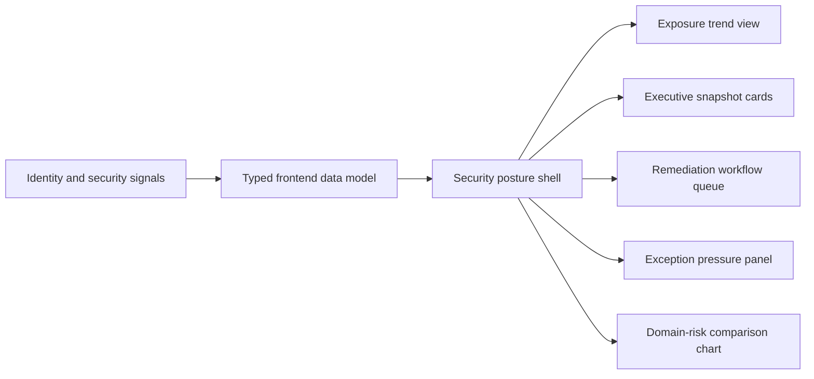
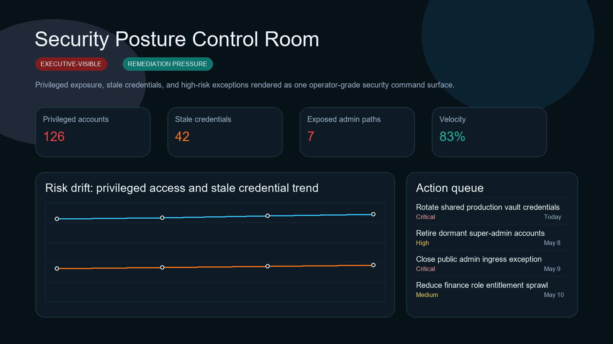
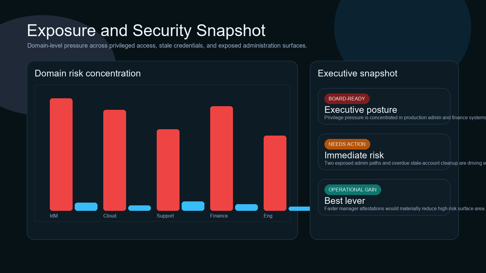
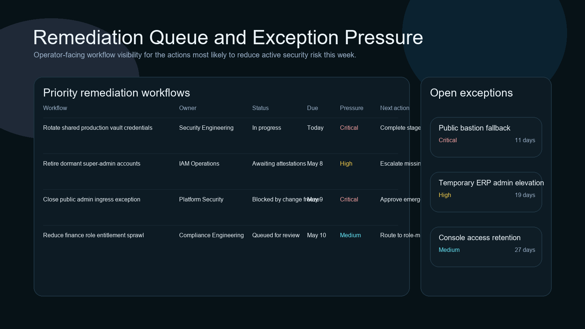
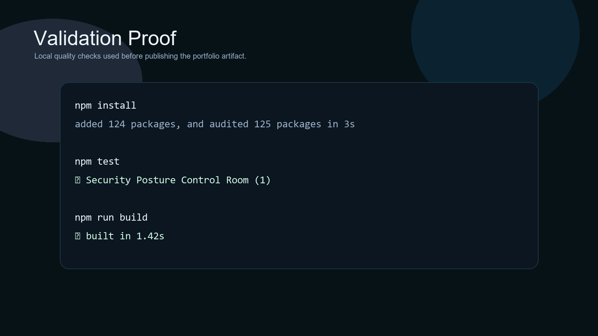

# Security Posture Control Room

> **React + TypeScript portfolio project** demonstrating privileged-access posture, stale credential pressure, exposed admin-path visibility, exception governance, and operator-facing security workflow design.

**Recruiter takeaway:** *"This person can turn security posture into a real executive and operator control surface, not just a list of findings."*

---

## Project Overview

| Attribute | Detail |
|---|---|
| **Frontend Stack** | React 19 + Vite + TypeScript |
| **Domain** | Security posture, identity drift, remediation workflows |
| **Audience** | Security leadership, IAM, platform engineering, compliance |
| **Signal Areas** | Privileged exposure · stale credentials · admin-path risk · remediation velocity |
| **Portfolio Role** | Frontend proof of security command-surface product thinking |
| **Validation** | Vitest + Testing Library |

---

## Executive Summary

Security Posture Control Room is a recruiter-ready frontend project designed to feel like a real internal security operations workspace. Instead of treating identity and access posture like a static audit export, it turns privileged exposure, stale credentials, public admin paths, and remediation pressure into one command surface that leadership and operators can act on.

This repo is built to show that security governance can be operational, executive-readable, and product-minded at the same time.

---

## Business Problem

Security posture often gets fragmented across IAM review exports, cloud findings, ticket queues, and exception trackers. That makes it hard to answer simple operational questions:

- where privileged exposure is actually concentrated
- which stale credentials are aging into risk
- which exceptions are lingering too long
- which remediation actions deserve executive pressure now

Teams need a workspace that turns risk posture into coordinated action, not just scattered evidence.

---

## Solution

This project reframes security posture as an operator-grade product surface for:

- privileged-access visibility
- stale-credential risk tracking
- exception governance
- remediation queue execution
- executive security posture reporting

---

## Architecture



### Workspace Flow

1. Security leadership lands on one posture summary.
2. Exposure trends show where privileged access and stale credentials are drifting.
3. Snapshot cards translate posture into board-ready and operator-ready language.
4. The action queue makes remediation pressure concrete.
5. Exception tracking keeps lingering waivers visible instead of hidden in audit notes.

---

## Screenshots

### Hero Capture



### Exposure and Executive Snapshot



### Action Queue and Exceptions



### Validation Proof



---

## Key Design Decisions

| Decision | Rationale |
|---|---|
| **Control-room framing** | Makes the repo feel like active security operations rather than static governance reporting |
| **Executive + operator pairing** | Shows both leadership readability and practical remediation flow |
| **Static data model** | Keeps the project easy to run while preserving product realism |
| **Security-native visual theme** | Gives the repo a distinct posture compared with compliance and identity workflow repos |
| **Risk and queue emphasis** | Surfaces what action is needed now, not just what exists | 

---

## What An Engineering Leader Sees Here

- frontend execution grounded in security workflow reality
- ability to turn control objectives into product surfaces
- strong internal-tool UX judgment
- portfolio range across security, governance, revenue, identity, and executive systems

---

## Getting Started

### Prerequisites

- Node.js 20+
- npm

### Setup

```bash
git clone https://github.com/mizcausevic-dev/security-posture-control-room.git
cd security-posture-control-room
npm install
cp .env.example .env
npm run dev
```

Open:

- `http://localhost:5173`

### Run Tests

```bash
npm test
```

### Build

```bash
npm run build
```

---

## What This Demonstrates

- security-governance product thinking
- posture and remediation workflow design
- executive-facing internal-tool UX
- React + TypeScript delivery with production-minded repo hygiene
- security portfolio breadth beyond basic IAM reporting

---

## Future Enhancements

- drilldown evidence timelines
- policy-owner handoff workflows
- vulnerability and asset overlays
- ticketing and identity-provider integrations
- trend forecasting for remediation backlog pressure

---

## Tech Stack

[](https://react.dev/)
[](https://vite.dev/)
[](https://www.typescriptlang.org/)
[](https://recharts.org/en-US/)
[](https://vitest.dev/)
[](https://opensource.org/license/mit)

### Portfolio Links

- [LinkedIn](https://www.linkedin.com/in/mirzacausevic)
- [Skills Page](https://mizcausevic.com/skills/)
- [Medium](https://medium.com/@mizcausevic)
- [GitHub](https://github.com/mizcausevic-dev)

---

*Part of [mizcausevic-dev's GitHub portfolio](https://github.com/mizcausevic-dev) — demonstrating security posture product thinking, operator-facing control-plane UX, and executive-readable risk workflow design.*
