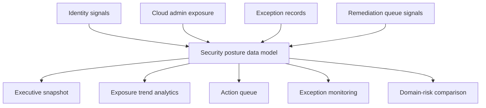

# Security Posture Control Room Architecture

## Intent

Security Posture Control Room is a frontend-first internal tool concept for making privileged exposure, stale credentials, exception posture, and remediation pressure visible in one place.

The product is intentionally positioned between executive readability and operator urgency.

## System Flow

## Product Surfaces

- **Executive snapshot**: translates posture into leadership-readable signals
- **Exposure trend**: shows drift in privileged access and stale credentials
- **Action queue**: prioritizes remediation workflows by urgency
- **Exception monitoring**: keeps aging waivers visible
- **Domain-risk comparison**: reveals where risk is concentrated

## Why This Matters

This repo exists to show that security posture can be treated like an operational product:

- measurable
- navigable
- executive-readable
- directly tied to action

That makes it a stronger portfolio signal than a generic “security dashboard” clone.
